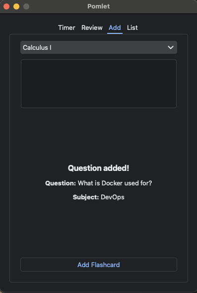
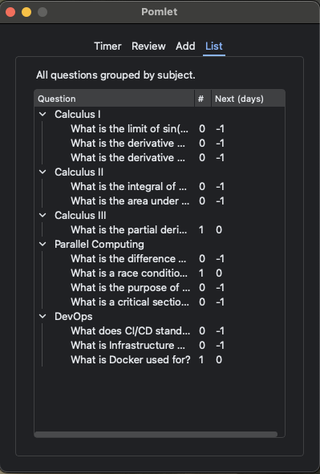
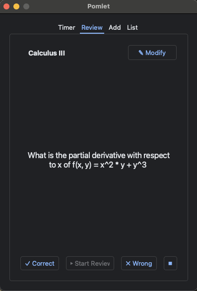
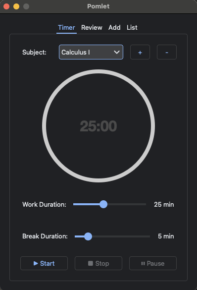
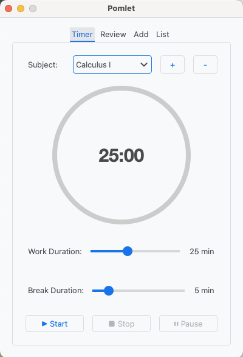

# 🍅 Pomlet — A Pomodoro Timer and Flashcard Review App for Students

**Pomlet** is a simple, focused desktop app designed for university students (like myself, currently pursuing a master's degree) to stay productive and retain what they learn. It combines a distraction-free **Pomodoro timer** with a minimalistic **flashcard review system**, grouped by **subjects** like your courses.

---

## 🖼 Screenshots

| Add Flashcard | List All Flashcards | Review Flashcards |
|:-------------:|:------------------:|:------------------:|
|  |  |  |

| Timer | Light OS Appearance |
|:-----:|:-------------------:|
|  |  |

---

## ✨ Features

- ⏱ **Pomodoro Timer**: Focus in 25-minute intervals with automatic short and long breaks.
- 🗓 **Apple Calendar Integration** (macOS): If granted permission, Pomlet automatically logs each Pomodoro work session to your calendar, letting you look back at what you studied and when.
- 📚 **Flashcard Review**: Easily create and review flashcards with spaced repetition tracking.
- 🗂 **Subject Organization**: Group your cards by course or topic for better structure.
- 🖥 **System Tray Integration**: Control the timer from your tray — clean and unobtrusive.
- ⌨️ **Keyboard Shortcuts**: Mark flashcards correct/wrong with arrow keys for quick flow.
- 💾 **Persistent Storage**: All data is saved **_locally_**.
- 🎓 **Student-Centric Design**: Built by a student, based on real academic experience and a deep personal interest in **study efficiency**, **evidence-based learning**, and cognitive science research. Pomlet reflects both practical needs and scientifically informed practices.

> ⚠️ **Note on Flashcards**  
> Pomlet is based on evidence-based learning strategies.  
> **Flashcards intentionally do not include answers.**  
> Research shows that **active recall** — retrieving information without seeing the answer — improves long-term retention and builds stronger mental models. Pomlet encourages this by helping you **form mental connections**, not just memorize.

---

## 🚀 Getting Started

---

## 📦 Releases

The **release version** of Pomlet is simply the latest build created using [PyInstaller](https://pyinstaller.org/).

> ⚠️ **Notice**  
> If you download Pomlet from the releases section, macOS may flag it as **unverified software** because the app is **not signed or notarized** by Apple.  
> This is expected.

You have two options:

1. **Allow the app manually:**

   Go to:  
   `System Settings → Privacy & Security`  
   Then click:  
   **“Open Anyway”** next to the *Pomlet was blocked* message.

2. **Build Pomlet from source:**  
   To avoid the warning, you can clone this repo and build it yourself with PyInstaller:

   ```bash
    $ uv sync
    $ .venv/bin/pyside6-rcc assets/assets.qrc -o src/gui/assets.py
    $ uv run python -m PyInstaller --icon=icon.png --windowed --name=Pomlet main.py --noconfirm

This bundles everything into a single executable in the `dist/` folder. You can then distribute or run `Pomlet` directly.

### 🧱 To Implement / Improve
- [x] iCalendar integration
- [ ] Full `Question` class
- [ ] JSON or SQLite database
- [ ] Flashcard import/export
- [ ] Optional cloud backup

---

## 🧠 Why Pomlet?

This app was built to support **self-guided study**.

Pomlet is the result of a long personal journey — an *infinite search*, trying countless tools to improve how I study. Many had great features, but were often bloated, overly complex, or locked behind expensive paywalls.  
While some premium tools are genuinely helpful, the cost of being efficient at learning shouldn't be a luxury.

**Pomlet is my answer to that**: a lightweight, simple yet effective, and *free* tool that helps you stay focused and retain information — without unnecessary complexity or cost. Everyone deserves the opportunity to study well.
---

## 📜 License

GPL License © 2025 — Manueel62